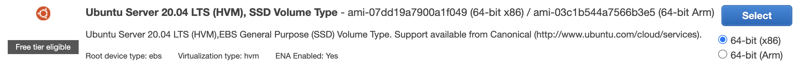

# The spring-idea repo is a very simple introduction to Spring
Purpose of this repo is to build up the very basics of Spring and Java.  This is used for educational purposes, it has no real project purpose.

## Run this project and try to understand some of its parts.  Be sure to upgraded to IntelliJ IDEA Ultimate!!!  Then clone it.
<OL> 
<LI>Using IntelliJ clone Repo</LI>
<LI>Run main method in src/main/java/com.example.demo/Hello.java</LI>
<LI>In browser type: localhost:8080</LI>
</OL>
Notes:
<OL>
<LI>The src/resources/templates/index.html is the default HTML page. It introduces some things in this project.</LI>  
<LI>Examine ThymeLeaf fragments (headfile.html, header.html, footer.html) to get familiar with Templates and see how they are included in other html files.</LI>
<LI>Find Main.java and MainContoller.java to understand annotations and routes. This will help you learn code behind HTML</LI>
</OL>

## Instruction for Spring/Java developer

To get started with development, you should spend time with these links:

Hello World:
[Jetbrains on beginning your own project](https://www.jetbrains.com/help/idea/your-first-spring-application.html)

Everything about Spring from sping.io:
[Spring Homesite](https://spring.io/)

At the end of each development cycle it is a good practice to create a self-contained JAR file for deployment.  IntelliJ (IJ) can delegate Maven to build a Jar that works for deployment.  This file can be copied to a new host and run according to deployment instructions in the document.

Start by picking "Maven" off of right boarder of IJ.  Click-on the "Wrench" on Maven screen. Navigate to Maven Settings.

Drill into Maven > Runner (Build,Execution,Depoyment > Build Tools > Maven > Runner).  Click and Apply setting "Delegate IDE build/run actions to Maven". 

Returning to IJ Project work use the "Hammer" to build (not the traditional "Play") this will produce a VERY USEFUL deployment Jar which is created in "Target" path as shown.

# Instruction on purchasing a Raspberry Pi and preparing for Webserver deployment
Raspberry Pi 4 specification
<OL> 
<li> Raspberry Pi 4 4GB Model B with 1.5GHz 64-bit quad-core CPU (4GB RAM) </li>
<li> 32GB Samsung EVO+ Micro SD Card (Class 10) Pre-loaded with NOOBS, USB MicroSD Card Reader </li>
<li> Raspberry Pi 4 Case </li>
<li> 3.5A USB-C Raspberry Pi 4 Power Supply (US Plug) with Noise Filter</li>
<li> Set of Heat Sinks </li>
<li> Micro HDMI to HDMI Cable - 6 foot (Supports up to 4K 60p) </li>
<li> USB-C PiSwitch (On/Off Power Switch for Raspberry Pi 4) </li>
</OL> 

Purchase Notes:  Keyboard, Mouse, Monitor are optional.  RPi advantages over AWS: 1. One time cost  2. All kinds of tinker projects in IOT realm can be performed using GPIO pins.  As for purchase options, CanaKit (my prefered) has options on Amazon that meet the bulleted list of requirements. There is a new option on raspberrypi.org that describes RPi as built into a keybaord (could be bulky in my use cases).   

Webserver deployment preparation: RPi with NOOBS installed on SSD is very simple.  At boot select Raspberry Pi OS and you are on your way.  Since this will be private IP host on your home network, Port Forwarding is required to make your website visible on the Internet. 

Runtime Notes: Mostly I use VNC Viewer to connect to the RPi.  This is a full desktop remote display tool.  RealVNC lets you share full desktop with cohorts.  If you reboot RPi, you need a monitor connected at reboot to maintain VNC screen share functionality.  Reboot will cause screen buffer not to be recognized unless HDMI is present.  There may be a dummy (mini) HDMI plug that could overcomee this issue.  Otherwise, after setup your RPi could be headless.
 

# Instruction on preparing AWS EC2 instance for Webserver deployment
Login into your AWS IAM user, search for EC2.

To get started, launch an Amazon EC2 instance, which is a virtual server in the cloud.

## Step 1: Choose an Amazon Machine Image (AMI)Cancel and Exit
An AMI is a template that contains the software configuration (operating system, application server, and applications) required to launch your instance. Pick Ubuntu free tier operating system that uses the Linux kernel.  Note, this is very compatible Raspberry Pi's OS.

## Step 2: Choose an Instance Type
Amazon EC2 provides a wide selection of instance types optimized to fit different use cases. Instances have varying combinations of CPU, memory, storage, and networking capacity.   Stick with Free Tier options, as of this writing t2.mico with free tier designation is suggested.

## No action on Steps #3 through #4
Step 3: Configure Instance Details
Stick with default.  Your will launch a single instance of the AMI by using defaults

Step 4: Add Storage
Stick with default.  Your instance will be launched with 8gb of storage. 

## Step 5: Add Tags
Tag your Amazon EC2 resources.  This is not required but you could name your volume for future identification.

## Step 6: Configure Security Group
A security group is a set of firewall rules that control the traffic for your instance. On this page, you can add rules to allow specific traffic to reach your instance. In this example, a web server is setup to allow Internet traffic to reach EC2 instance, this allows unrestricted access to the HTTP and HTTPS ports.  Also, this example restricts SSH from my IP.

## Step 7: Review Instance Launch
Review your instance launch details. Click Launch to assign a key pair to your instance and complete the launch process.

## Before you leave your ADMIN session on AWS go to EC2 running instances and find your IPV4 address.

# Start a terminal session on you localhost.  

   
## SSH (secure shell) to your EC2 machine
   
### MacOS login into the EC2 instance using SSH

Manage your PEM file, rename and move to SSH configuration directory, setting permission on my PEM file to protect it:
  
    MacBook-Pro-2:~ johnmortensen$ cd
    MacBook-Pro-2:~ johnmortensen$ sudo mv spring.pem .ssh/ec2spring.pem
    MacBook-Pro-2:~ johnmortensen$ sudo chmod 600 .ssh/ec2spring.pem

SSH command

    MacBook-Pro-2:~ johnmortensen$ cd
    MacBook-Pro-2:~ johnmortensen$ sudo ssh -i .ssh/ec2spring.pem ubuntu@52.34.146.159
   
This should lead you to a NEW terminal prompt on ubuntu:

    ubuntu@ip-172-31-30-21:~$
   
### Windos login into ECW using SSH using puTTY
To SSH on a windows machine you will need to use [puTTY](https://www.chiark.greenend.org.uk/~sgtatham/putty/latest.html). (Download correct bit installer and keep default settings).

Add your EC2 instance ip into the putTTY IP bar and keep the port set as 22 (The standard SSH port)

Open the puTTYgen app, (not puTTY), select "RSA: at the bottom and then click "load". Choose the .pem file downloaded from AWS earlier. Click "save private key" and click yes if you get a warning. Save this new .ppk file safely.

In the navigation bar at the left, expand "SSH" and select "Auth". Under "private Key File for authentication" click browse change the setting to search for all files and select the .pem file downloaded from AWS in the previous step. Click Open to start the connection, if you get a warning message just click yes. Log in as "ec2-user". Now you have access to the ubuntu machine.

# Instruction on deploying Spring/Java Jar file to Raspberry Pi OS or AWS EC2 Ubuntu
Background.  Java is its own server.  A Java program runs servlets, aka the Java-enabled web server.  Servlets work on the server-side. Servlets are capable of handling complex requests obtained from web server.

First you need to install Java on your OS.  The default as of this writing is OpenJDK 11 for both Raspberry Pi OS and Ubuntu.

    pi@raspberrypi:~ $ sudo apt update; sudo apt upgrade
    pi@raspberrypi:~ $ sudo apt install default-jdk
    
## Move JAR file to your deployment host.  This procedure shows an option for JAR file from MacOS to Ubuntu on AWS

   MacBook-Pro-2:~ sftp -i ~/.ssh/ec2spring.pem ubuntu@52.34.146.159
    Connected to ubuntu@52.34.146.159.
    sftp> put serving-web-content-0.0.1-SNAPSHOT.jar
    Uploading serving-web-content-0.0.1-SNAPSHOT.jar to /home/ubuntu/serving-web-content-0.0.1-SNAPSHOT.jar
    serving-web-content-0.0.1-SNAPSHOT.jar        100%   18MB   1.8MB/s   00:09  

## Java service configuration
To run and start application automatically it will require a JAR file from previous step and a .service file that executes java. In this service file we are providing details the service: it should start after “network.target” has been started, ExecStart is the command that executes the service, currently this is running a JAR file. Create a 'service' file like the one below and place it in: /etc/systemd/system/<your_service_file>.service

    [Unit]
    Description=Java
    After=network.target

    [Service]
    User=pi
    Restart=always
    ExecStart=java -jar /home/pi/IdeaProjects/spring-idea/target/serving-web-content-0.0.1-SNAPSHOT.jar
    [Install]
    WantedBy=multi-user.target 
 
## Java service commands using systemctl
Running these commands will test your service:
 
    pi@raspberrypi:~ $ sudo systemctl start <my_service_file>.service
    pi@raspberrypi:~ $ sudo systemctl stop <my_service_file>.service

Running these commands will enable or disable service at a reboot:

    pi@raspberrypi:~ $ sudo systemctl enable <my_service_file>.service
    pi@raspberrypi:~ $ sudo systemctl disable <my_service_file>.service

## Nginx service configuration
Now that the Spring application is running as a service, an Nginx proxy allows opening the application to an unprivileged port and setting up SSL.

Install Nginx
    pi@raspberrypi:~ $ sudo apt install nginx

Create an Nginx configuration for the reverse proxy, File: /etc/nginx/sites-availble/<my_nginx_file>
    
    server {
        listen 80;
        server_name csa.nighthawkcoders.cf 192.168.1.208 70.95.179.231;        
            server_name example.com;
   
            location / {
                 proxy_pass http://localhost:8080/;
                 proxy_set_header X-Forwarded-For $proxy_add_x_forwarded_for;
                 proxy_set_header X-Forwarded-Proto $scheme;
                 proxy_set_header X-Forwarded-Port $server_port;
            }
    }

## Nginx service commands
Test the configuration to make sure there are no errors:

    pi@raspberrypi:~ $ sudo ln -s /etc/nginx/sites-available/<my_nginx_file> /etc/nginx/sites-enabled
    pi@raspberrypi:~ $ sudo nginx -t

If there are no errors, restart NGINX so the changes take effect:

    pi@raspberrypi:~ $ sudo systemctl restart nginx
    

